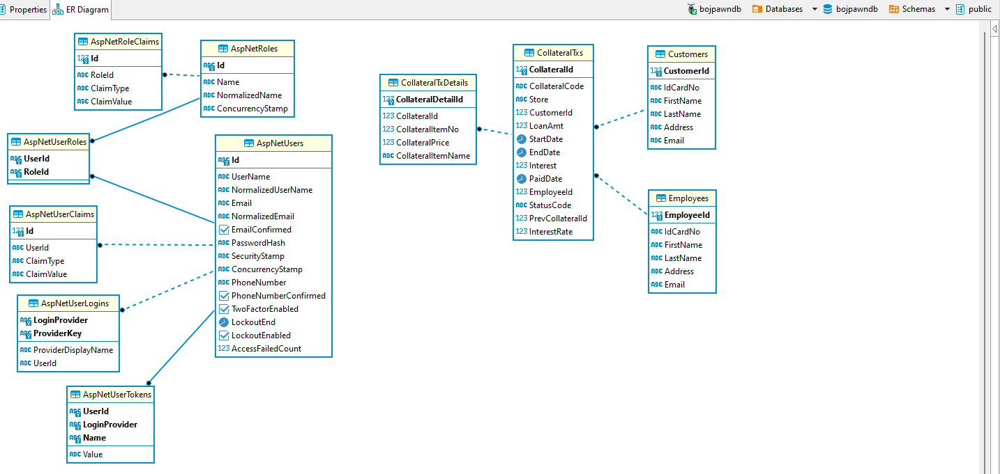

# Schema



# How to Run

Note: In dotnet 7 add -lp --launch-profile 
```shell
dotnet run --launch-profile https
```

# API

https://localhost:7021/swagger


# cockroachdb

Web GUI

```bash
kubectl port-forward service/cockroachdb-public 8080 -n g1dev
```

Web GUI : https://localhost:8080

Access DB

```bash
kubectl port-forward service/cockroachdb-public 26257 -n group-1-bojdev
```

# Test With Container

## Run 

```
#PROD
docker run -p 10600:8090 --name bojapi pingkunga/bojpawnapi:0.0.2

#DEV
docker run -p 10600:8090 --name bojapi -e ASPNETCORE_ENVIRONMENT=Development pingkunga/bojpawnapi:0.0.4

http://localhost:10600/swagger/index.html
```

## Build Locally

```
docker buildx build --load --platform linux/amd64 -t pingkunga/bojpawnapi:0.0.1 .
docker buildx build --load --platform linux/arm64 -t pingkunga/bojpawnapi:0.0.1 .
```

## Build and Push

```
docker buildx build --push --platform linux/amd64,linux/arm64 -t pingkunga/bojpawnapi:0.0.1 .

docker buildx build --push --platform linux/amd64 -t pingkunga/bojpawnapi:0.1.0 .

docker run -p 10600:8090 --name bojapi -e ASPNETCORE_ENVIRONMENT=Development pingkunga/bojpawnapi:0.1.0

docker run -p 10600:8090 --name bojapi -e ASPNETCORE_ENVIRONMENT=Development pingkunga/bojpawnapi:0.0.4
```


# Issues

* ARM Cannot Build


# Other 

## Lib

```bash
dotnet add package Npgsql.EntityFrameworkCore.PostgreSQL
dotnet add package Microsoft.EntityFrameworkCore.Design
dotnet add package Microsoft.EntityFrameworkCore.Tools
dotnet add package AutoMapper.Extensions.Microsoft.DependencyInjection 

dotnet add package Microsoft.AspNetCore.Authentication.JwtBearer --version 8.0.0
dotnet add package Microsoft.AspNetCore.Identity.EntityFrameworkCore --version 8.0.0

```

## EF Command

```bash
List out pending migrations
dotnet ef migrations list --project DbExploration.csproj

Update database with pending migrations
dotnet ef database update --project DbExploration.csproj

ถ้ามีแก้ Field
dotnet ef migrations add secodtmigration
```

## Health Check

* https://learn.microsoft.com/en-us/aspnet/core/host-and-deploy/health-checks?view=aspnetcore-7.0
* https://github.com/Xabaril/AspNetCore.Diagnostics.HealthChecks/blob/master/doc/kubernetes-liveness.md
* https://github.com/Xabaril/AspNetCore.Diagnostics.HealthChecks
* https://stackoverflow.com/questions/60142080/dotnet-core-healthchecks-postgres-connectionstring-query
* https://www.davidguida.net/health-checks-with-asp-net-core-and-kubernetes/
* https://blog.devart.com/how-to-implement-health-checks-in-asp-net-6.html

ดูไม่เกี่ยวกับ health check แต่เป็นการอ่าน connection string จาก appsettings.json
* https://code-maze.com/dotnet-read-connection-strings/

```bash
https://learn.microsoft.com/en-us/aspnet/core/host-and-deploy/health-checks?view=aspnetcore-7.0

dotnet add package AspNetCore.HealthChecks.Npgsql
```
System.InvalidOperationException: Unable to resolve service for type 'bojpawnapi.Service.ICollateralService' while attempting to activate 'bojpawnapi.Controller.CollateralsController'.
   at Microsoft.Extensions.DependencyInjection.ActivatorUtilities.GetService(IServiceProvider sp, Type type, Type requiredBy, Boolean isDefaultParameterRequired)
   at lambda_method17(Closure, IServiceProvider, Object[])
   at Microsoft.AspNetCore.Mvc.Controllers.ControllerFactoryProvider.<>c__DisplayClass6_0.<CreateControllerFactory>g__CreateController|0(ControllerContext controllerContext)
   at Microsoft.AspNetCore.Mvc.Infrastructure.ControllerActionInvoker.Next(State& next, Scope& scope, Object& state, Boolean& isCompleted)
   at Microsoft.AspNetCore.Mvc.Infrastructure.ControllerActionInvoker.InvokeInnerFilterAsync()
--- End of stack trace from previous location ---
   at Microsoft.AspNetCore.Mvc.Infrastructure.ResourceInvoker.<InvokeFilterPipelineAsync>g__Awaited|20_0(ResourceInvoker invoker, Task lastTask, State next, Scope scope, Object state, Boolean isCompleted)
   at Microsoft.AspNetCore.Mvc.Infrastructure.ResourceInvoker.<InvokeAsync>g__Awaited|17_0(ResourceInvoker invoker, Task task, IDisposable scope)
   at Microsoft.AspNetCore.Mvc.Infrastructure.ResourceInvoker.<InvokeAsync>g__Awaited|17_0(ResourceInvoker invoker, Task task, IDisposable scope)
   at Microsoft.AspNetCore.Routing.EndpointMiddleware.<Invoke>g__AwaitRequestTask|6_0(Endpoint endpoint, Task requestTask, ILogger logger)
   at Microsoft.AspNetCore.Authorization.AuthorizationMiddleware.Invoke(HttpContext context)
   at Swashbuckle.AspNetCore.SwaggerUI.SwaggerUIMiddleware.Invoke(HttpContext httpContext)
   at Swashbuckle.AspNetCore.Swagger.SwaggerMiddleware.Invoke(HttpContext httpContext, ISwaggerProvider swaggerProvider)
   at Microsoft.AspNetCore.Authentication.AuthenticationMiddleware.Invoke(HttpContext context)
   at Microsoft.AspNetCore.Diagnostics.DeveloperExceptionPageMiddlewareImpl.Invoke(HttpContext context)

HEADERS
=======
Accept: text/plain
Host: localhost:7021
User-Agent: Mozilla/5.0 (Windows NT 10.0; Win64; x64) AppleWebKit/537.36 (KHTML, like Gecko) Chrome/119.0.0.0 Safari/537.36 Edg/119.0.0.0
Accept-Encoding: gzip, deflate, br
Accept-Language: en-US,en;q=0.9,th;q=0.8
Content-Type: application/json
Cookie: wordpress_test_cookie=WP%20Cookie%20check; wordpress_logged_in_37d007a56d816107ce5b52c10342db37=test%7C1697333538%7CyohGv1B1UIofiScVQwVAG4eAYFe0yuzJCiSWiPot4HZ%7Cb2972813042cf1a4d12b011c05007e4aae48fb1d150e8796b2d7e4b2c6784b1e; wp-settings-time-1=1697160742; PGADMIN_LANGUAGE=en; io=mJfQmTLgF5eYGQpsAAAA
Origin: https://localhost:7021
Referer: https://localhost:7021/swagger/index.html
Content-Length: 866
sec-ch-ua: "Microsoft Edge";v="119", "Chromium";v="119", "Not?A_Brand";v="24"
sec-ch-ua-mobile: ?0
sec-ch-ua-platform: "Windows"
sec-fetch-site: same-origin
sec-fetch-mode: cors
sec-fetch-dest: empty
```

# PAWN

```
{
  "collateralId": 0,
  "collateralCode": "string",
  "store": "inventory-1",
  "prevCollateralId": 0,
  "customerId": 1,
  "loanAmt": 3000,
  "startDate": "2023-11-26T15:26:35.124Z",
  "endDate": "2023-12-26T15:26:35.124Z",
  "interest": 0,
  "paidDate": "2023-12-26T15:26:35.124Z",
  "employeeId": 1,
  "statusCode": "string",
  "collateralDetaills": [
    {
      "collateralDetailId": 0,
      "collateralId": 0,
      "collateralItemNo": 1,
      "collateralPrice": 3000
    }
  ]
}
```

response
```
{
  "code": "S201-003-10",
  "message": "Pawn created successfully",
  "description": "The item was added to the database",
  "timestamp": "2023-11-26T15:28:59.1141251Z",
  "data": {
    "collateralId": 1,
    "collateralCode": "COLL20231126152858",
    "store": "inventory-1",
    "prevCollateralId": 0,
    "customerId": 1,
    "loanAmt": 3000,
    "startDate": "2023-11-26T15:26:35.124Z",
    "endDate": "2023-12-26T15:26:35.124Z",
    "interest": 90,
    "paidDate": "2023-12-26T15:26:35.124Z",
    "employeeId": 1,
    "statusCode": "PAWN",
    "collateralDetaills": [
      {
        "collateralDetailId": 1,
        "collateralId": 1,
        "collateralItemNo": 1,
        "collateralPrice": 3000
      }
    ]
  }
}
```

# Rollover

```

```


curl -X 'POST' \
  'https://localhost:7021/api/Employee' \
  -H 'accept: text/plain' \
  -H 'Content-Type: application/json' \
  -d '{
  "idCardNo": "1234456",
  "firstName": "pingkunga",
  "lastName": "pingkunga",
  "address": "pingkunga",
  "email": "pingkungb@gmail.com",
  "employeeId": 0,
  "username": "pingkunga",
  "password": "Invs$erver@pwd01"
}'